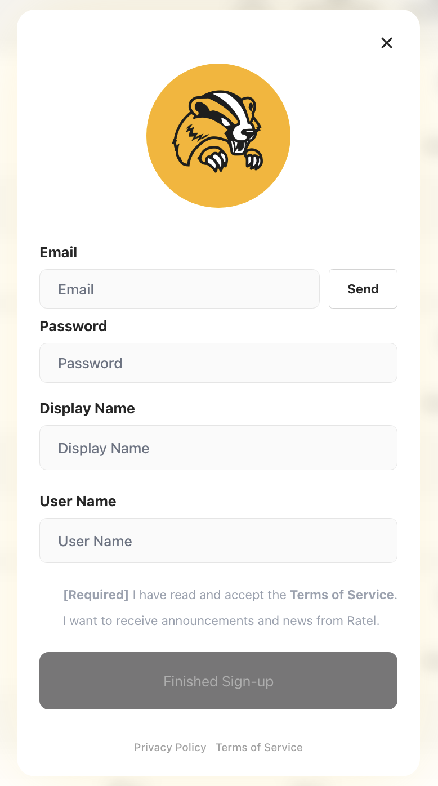

# Introduction to Spaces

Ratel Spaces provide a collaborative environment for your team.

## Features

* Collaborative workspaces
* Real-time updates
* Team management
* Access control

## Getting Started

This guide provides step-by-step instructions for both Creators and Participants to effectively use Ratel Spaces. You will learn how to create a team, set up posts and spaces, invite participants, run discussions, conduct surveys, and export data. Each section includes clear steps, recommended UI actions, and screenshots to help you follow along.

## 1. Creator - Deliberation Space Settings

### (1) Sign Up

To begin using Ratel, create your account. Ratel offers two ways to sign up: Email and Google.

**Email Sign Up**

1. Go to the Sign Up page and click **Create an account**.
2. Enter your email address and receive a verification code.
3. Input the verification code.
4. Set your password.
5. Enter your display name and username.
6. Click **Complete Sign Up**.

*(Screenshot: Email Sign Up form with fields for email, verification code, password, display name, username)*

**Google Sign Up**

1. On the Sign Up page, click **Continue with Google**.
2. Click the Google icon, choose your account, and grant permissions.

*(Screenshot: Continue with Google button — click the Google icon, choose your account, and grant permissions)*

### (2) Create a Team

1. Click **Create a Team**.
2. Enter a Team display name, Team ID and description.
3. Invite colleagues by selecting **Manage Group - Invite Members** and entering their email addresses.

*(Screenshot: Teams dashboard with “Create Team” button)*

### (3) Create a Post

1. From the home screen, click the **Create Post** button.
2. Enter a title and description for the post.

   *(Screenshot: Create Post form with title and description fields)*

### (4) Create a Space

1. Select the **Deliberation** type to create a Space with your post.
2. **Add an Overview**: Provide context, goals, and participation guidelines.
3. **Upload Files**: Attach supporting documents and reference materials.
4. **Create Pre-Poll Survey**: Build a survey to collect participant background and baseline opinions.
5. **Board** : Create a dedicated board for discussion and posts.
6. **Members** : Invite members to your Space.
7. **Panels** : Set up the panels who will participate in the Space.
8. **Enable Anonymous Participation** (optional): Allow participants to hide their display names.
9. **Enable Change Visivility** (optional) : Allow the visibility status of the post to be changed.
10. **Set Space to Private**: Restrict access to invited participants only.
11. *(Screenshot: Spaces settings with Overview, Files, Pre-Survey, Anonymous and Privacy options)*

### (5) Sending Invitation Links

When the creator publishes the Space, an invitation email is automatically sent to the invited members.

**Note:** Once the Space is started, new participants cannot join.

*(Screenshot: Invite Link generation screen)*

## 2. Participant - Join Deliberation Space

### (1) Click Invite Link

1. Click the invitation link provided by the Creator.
2. Sign in or sign up if prompted.

*(Screenshot: Invite link landing page)*

### (2) Identity Verification

1. **Verifiable Credential**: Perform identity verification by entering the authentication code.

### (3) Complete Pre-Poll Survey

1. Take the Pre-Poll survey after completing your attributes.
2. Submit your responses.

*(Screenshot: Pre-survey interface)*

## 3. Creator - Start the Space

1. Click **Start Space**.

**Note:** Once the Space is started, new participants cannot join.

*(Screenshot: Start Space confirmation modal)*

## 4. Participant — Participation in the Discussion

1. Participants engage in the deliberation for a set period, writing comments, watching videos, and more.

*(Screenshot: Space discussion interface)*

## 5. Creator — Create Final-Survey

1. Navigate to **Surveys**.
2. Create and publish a **Final-Survey**.

*(Screenshot: Post-survey creation screen)*

## 6. Participant — Complete Final-Survey

1. Click the Final-survey.
2. Complete and submit the survey within the given timeframe.

*(Screenshot: Final-survey interface)*

## 7. Creator — Review Survey Results

1. Navigate to **Data Export**.
2. Click **Export Raw Data (CSV)**.
3. Analyze responses with participant attributes and pre/post survey matching.

*(Screenshot: Data export screen with CSV export button)*
